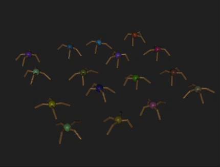

# 1_brax_training_viewer

This folder contains scripts to visualize Brax ant and multi-ant simulations.
Use MJPython to launch interactive viewers for ant-based environments.

## Run Instructions

```bash
mjpython 1_ant-viewer.py  # View single ant simulation
mjpython 2_multi-ant-viewer.py  # View multi-ant simulation
```

