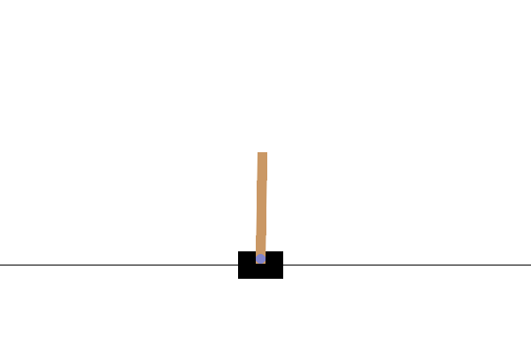

# 4_Q_learning

Demonstrates Q-Learning on CartPole and MountainCar environments with state discretization.
Shows off-policy TD learning and temporal-difference updates.

## Run Instructions

```bash
cd 4_Q_learning
python3 cart_pole.py  # Train and visualize CartPole agent
python3 mountain_car.py  # Train and visualize MountainCar agent
```

