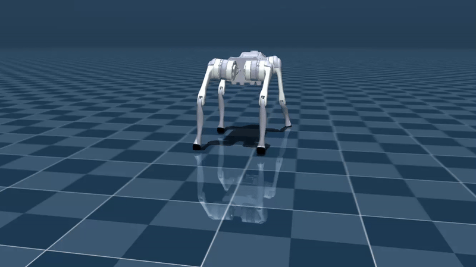

# Quad Move

**Code Authors:** Advait Desai and Gargi Gupta  
**Project Mentors:** Ansh Semwal and Prajwal Awhad  
**Program:** SRA VJTI's Eklavya 2025 Program

---

## About the Project

We aim to train a PPO-based gait policy in MuJoCo and deploy it on a low-cost, tortoise-style quadruped robot.

---

### Sample Demonstrations


| Go2 Quadruped Walk | Lunar Lander |
|:------------------:|:------------:|
|  |  |

| Blackjack | Frozen Lake |
|:---------:|:-----------:|
|  |  |


### Project Flow

1. Learn Reinforcement Learning basics (Monte Carlo, Q-Learning)
2. Learn Deep Learning (MNIST digit classifier)
3. Combine Deep Learning with RL (DQN, DDQN, TRPO, PPO)
4. Implement on environments (Brax, MuJoCo Menagerie, Bipedal, Go2)

---

## Project Components

### Foundation Learning
- **Monte Carlo Methods** - Basic RL policy evaluation
- **Q-Learning** - Value-based reinforcement learning
- **Deep Learning** - MNIST digit classification for neural network fundamentals

### Advanced RL Implementation
- **DQN/DDQN** - Deep Q-Networks for discrete action spaces
- **TRPO/PPO** - Trust Region and Proximal Policy Optimization for continuous control

### Environment Training
- **Brax** - High-performance physics simulation
- **MuJoCo Menagerie** - Diverse robotics environments
- **Bipedal Walker** - Humanoid locomotion
- **Go2 Quadruped** - Advanced quadruped robot simulation


---


## File Structure

```
quad_move_eklavya/
├── 1_brax_training_viewer/
├── 2_mujoco_menagerie/
│   └── flybody/
├── 3_monte_carlo/
├── 4_Q_learning/
├── 5_number_classifier/
├── 6_DQN/
├── 7_DDQN/
├── 8_PPO_bipedal/
└── 9_PPO_go2_stable_baselines/
```

---

## Getting Started

### Clone the Repository

```bash
git clone https://github.com/Advait2211/quad_move_eklavya.git
cd quad_move_eklavya
```

### Create a Virtual Environment

```bash
python3.10 -m venv venv
```

### Activate the Virtual Environment

**macOS/Linux:**
```bash
source venv/bin/activate
```

**Windows (PowerShell):**
```bash
.\venv\Scripts\activate
```

### Install Dependencies

```bash
pip install -r requirements.txt
```

---

## Requirements

- Python 3.10+
- MuJoCo physics engine
- PyTorch/TensorFlow for deep learning
- Stable Baselines3 for RL algorithms
- Additional dependencies listed in `requirements.txt`