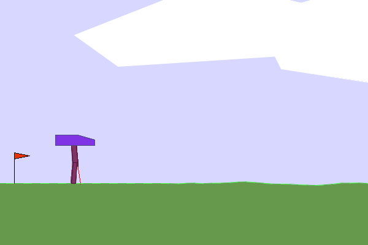

# Quad Move

Code Authors: **Advait Desai** and **Gargi Gupta**\
Project Mentors: **Ansh Semwal** and **Prajwal Awhad**\
This project is a part of SRA VJTI's Eklavya 2025 Program.

---

## 📖 About the Project
Train a PPO-based gait policy in MuJoCo and deploy it on a low-cost, tortoise-style quadruped.
Flow: Learn RL, Deep Learning, Deep learning with RL, implement on envrionments.   

---

## 📷 Project Demos

<p align="center">
  
  
</p>

<p align="center">
  
  
</p>

---

## 🚀 Getting Started

Follow these steps to set up and run the project:

### 1️⃣ Clone the Repository
```bash
git clone https://github.com/Advait2211/quad_move_eklavya.git
cd quad_move_eklavya
```

### 2️⃣ Create a Virtual Environment
```bash
python3.10 -m venv venv
```

### 3️⃣ Activate the Virtual Environment
- **macOS/Linux**
  ```bash
  source venv/bin/activate
  ```
- **Windows (PowerShell)**
  ```powershell
  .\venv\Scripts\activate
  ```

### 4️⃣ Change into Working Project Directory
```bash
cd working_code
```

### 5️⃣ Install Dependencies
```bash
pip install -r requirements.txt
```

---

## Various Projects to Run


### 1. Brax Training Viewer
<p align="left">
  
</p>

```bash
cd 1_brax_training_viewer
```

```bash
mjpython 1_ant-viewer.py
```

```bash
mjpython 2_multi-ant-viewer.py
```

### 2. Mujoco Menagerie
<p align="left">
  
</p>

```bash
cd 2_mujoco_menagerie
```

```bash
python3 main.py
```

### 3. Monte - Carlo
<p align="left">
  
  
</p>
Blackjack and Frozen Lake

```bash
cd 3_monte_carlo
```

```bash
python3 frozen_lake.py
```

### 4. Q - Learning
<p align="left">
  
  
</p>
Blackjack, Cartpole and Mountain Car

```bash
cd 4_Q_learning
```

```bash
python3 blackjack.py
```


### 5. Number Classifier


### 6. DQN
<p align="left">
  
</p>

```bash
cd 6_DQN
```

to visualise:
```bash
python3 lunar_lander_visualise.py
```

### 7. DDQN

```bash
cd 7_DDQN
```

to visualise:
```bash
python3 lunar_lander_gpu_ddqn.py
```

### 8. PPO - Bipedal
<p align="left">
  
</p>

```bash
cd 8_PPO_bipedal
```

to train:
```bash
python3 python3 biped.py
```

to visualise:
```bash
python3 test_biped.py
```

### 9. PPO - go2

```bash
cd 9_PPO_go2
cd walk
```

to train:
```bash
python3 python3 train_go2.py
```

to visualise:
```bash
python3 test_go2.py
```


✅ You are now ready to run the project! 🎉
